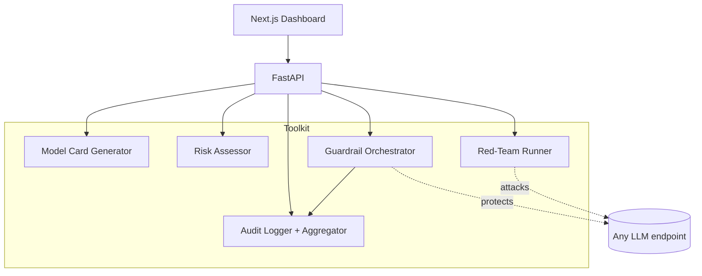

# AI Governance Toolkit — Architecture

> Status: **Design** · Owner: Jean Malaquias · Last updated: 2026-06-16

A deployable **runtime** toolkit for Responsible AI. Where the companion
[ai-governance-mapping](https://github.com/jeanmalaquias/ai-governance-mapping)
project is the *paperwork* — the unified controls catalog crosswalking NIST AI
RMF, the EU AI Act, OWASP LLM Top 10, and ISO/IEC 42001 — this project is the
*code that enforces and evidences those controls at runtime*.

## Components

| Component | What it does | Controls it satisfies |
|-----------|--------------|-----------------------|
| **Model Card Generator** | YAML spec → Markdown + HTML model card | Transparency (EU AI Act Art. 13, ISO A.8.2) |
| **Risk Assessor** | Questionnaire → RAG verdict + mapped controls + gaps | Risk mgmt (NIST MAP, EU Art. 9) |
| **Guardrail Orchestrator** | Composable pre/post-call moderation pipeline | Input/output safety (OWASP LLM01/LLM05, EU Art. 15) |
| **Red-Team Runner** | OWASP LLM Top 10 attack suite → scored report | Security testing (OWASP, EU Art. 15) |
| **Audit Logger + Aggregator** | Structured event schema, store, query API, redaction | Record-keeping (EU Art. 12, ISO A.6.2.8) |
| **FastAPI surface + Dashboard** | HTTP API + Next.js compliance view | Operability |

## Design principles

1. **Offline-deterministic by default.** Every component runs with no network or
   credentials — the guardrail and red-team backends default to deterministic
   heuristic implementations, so CI is hermetic and demos need no secrets. Real
   backends (Llama Guard 3, Azure AI Content Safety, AWS Bedrock Guardrails,
   NeMo Guardrails) implement the same interfaces and swap in by config.
2. **Pydantic everywhere.** Every input/output is a typed model.
3. **Composable.** The guardrail orchestrator chains backends; the red-team
   runner takes any `target` callable; the audit aggregator stores any event.
4. **Evidence-producing.** Each component emits the artifact an auditor asks for
   (a model card, a risk report, a red-team score, an audit trail).

## Architecture



## Guardrail orchestrator

A pre-call check runs before the model sees input; a post-call check runs on the
output. Each is a chain of `Guardrail` backends; the orchestrator denies on the
first block and records the verdict. Backends share one interface:

```python
class Guardrail(Protocol):
    name: str
    def check(self, text: str, stage: Stage) -> Verdict: ...
```

Default: `HeuristicGuard` (blocklist + prompt-injection + PII patterns). Real
backends register alongside it.

## Red-team runner

A versioned library of attack prompts, one set per OWASP LLM Top 10 category.
The runner sends each attack to a `target: Callable[[str], str]`, scores whether
the attack **succeeded** (a detector per category), and produces a report with a
pass rate per category. Run it against an unprotected vs. guardrail-protected
target to show the delta.

## Audit logger + aggregator

A structured `AuditEvent` (no raw PII — pseudonymous actor, digests not content),
an append store, and a query API (filter by tenant/action/time). Redaction
scrubs a stored event's sensitive fields while preserving the audit trail.

## Deployment

- `docker-compose.yml` — API + Postgres + (optional) OTel collector for local dev.
- Helm chart for Kubernetes.
- FastAPI behind OAuth2/bearer in production; downstream backend creds per tenant.

## Testing

Unit tests against the deterministic backends (pytest, 100% target). FastAPI
tested with `TestClient`. The dashboard build is verified with `next build`.
